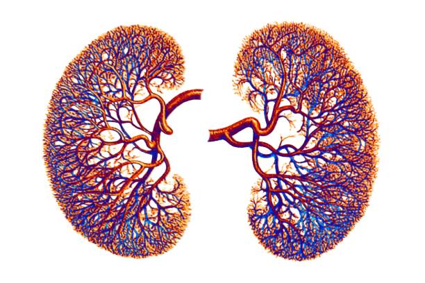
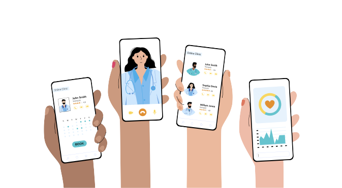
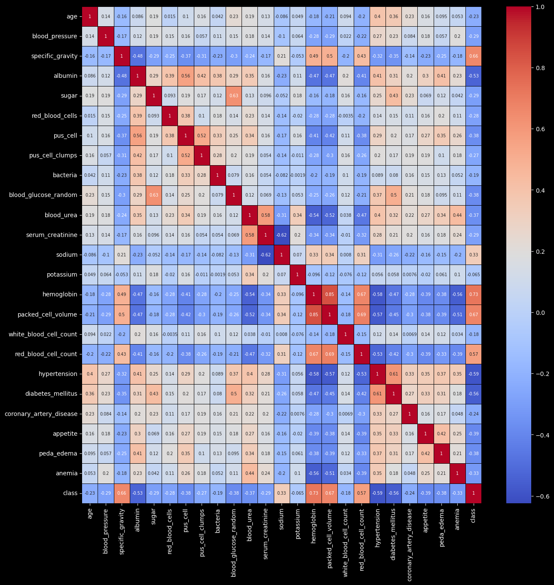
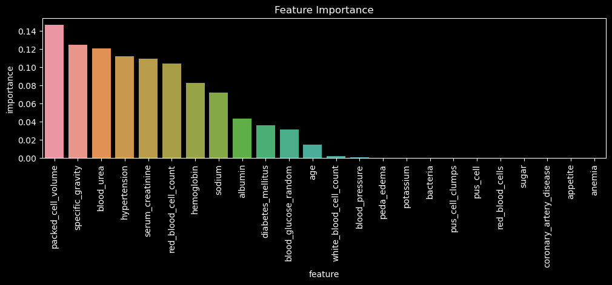
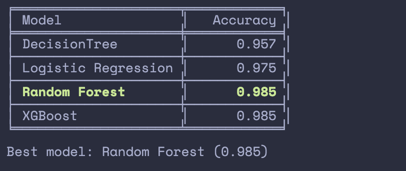
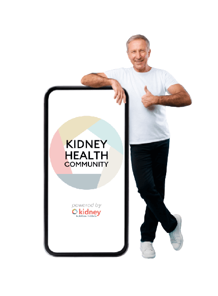

    <h1 style="font-size:40px;">HealAThon-Team-F</h1>
    <h2 style="font-size:40px;">Early Chronic Kidney Disease Prediction (CKD)</h2>
 

  

 
 
 
### Chronic Kidney Disease(CKD)

Chronic kidney disease is a condition characterized by progressive loss of kidney function over time. It is a silent disease, as most sufferers have no symptoms. If left untreated, CKD can progress to kidney failure and early cardiovascular disease. Early intervention can facilitate disease prevention, assist with the early planning of renal replacement therapy, and offer potential clinical and economic benefits to patients and health systems. Through supervised machine learning techniques, it is possible to predict early indicators of CKD.

 
 

    <h2 style="font-size:40px;">Objective (CKD)</h2>

 

Our goal is to develop an application that leverages the insights from data and helps doctors predict the impending occurrence of CKD early on. 
The data includes medical history, lab diagnosis results, and other information that will be used to train a Machine learning Model. 
This model will function as the basis of our application and will be able to predict the likelihood of CKD.  
Additionally, it will also have a patient interface which will help patients keep track of their appointments, medicine intake, diet, and exercise.  

 

> The App will be deployed through app stores and continuously updated to improve performance and usability.

 
 

    <h2 style="font-size:40px;">Market (CKD)</h2>

The market for a kidney disease detection app could potentially be significant, given the prevalence of kidney disease.  
An estimated **1 in 10** people worldwide have chronic kidney disease. Hence, our application will be helpful for both healthcare professionals and patients.  

> Healthcare providers can use the app to identify patients who are at high risk of developing kidney disease and provide appropriate care and treatment.  

> For Patients, it can be a means of tracking their habits and progress.

 
 

    <h2 style="font-size:40px;">Approach (CKD)</h2>

In our exercise, we used Supervised learning to develop our Machine Learning Model.  
Ours is a classification problem, so we have focused on tree-based, ensemble-based models and probabilistic models to draw insights from the data.
 
 

 

> First, the dataset was cleaned by handling missing values, correcting formats and inconsistencies, removing outliers, and transforming categorical data.

> Second, Exploratory Data Analysis was performed to understand the correlation between various features and their influence on the dependent variable.

> Then the data was split into train and test sets for training and testing our machine learning models respectively.

The different ML models used are:

- Decision Tree Classifier

- Logistic Regression

- Random Forest Classifier

- XGBoost

 

 

Each of these models was tuned using GridSearchCV to obtain the optimal hyperparameter values to develop models of the highest accuracy.  
Finally, using k-fold cross- validation we compared the models to finalise our base model for our application.

 

 
 

    <h2 style="font-size:40px;">Social Impact of our Product (CKD)</h2>

Kidney disease is a serious and growing health issue that affects millions of people around the world.  
Through our app, it is possible to raise awareness among the population helping in early detection and intervention. 
Subsequently, improving the quality of life of individuals and reducing the burden on our healthcare system.

